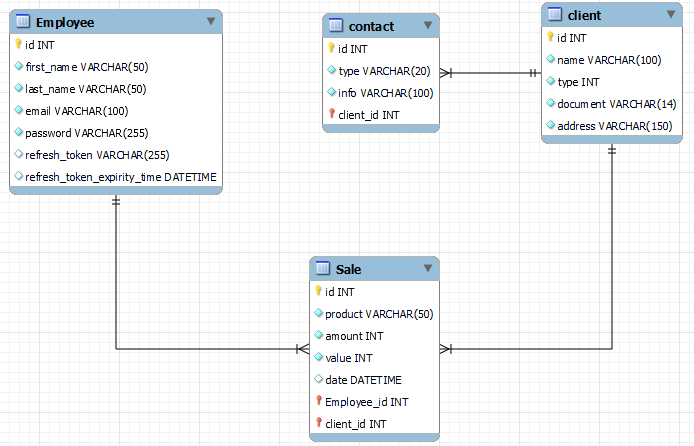
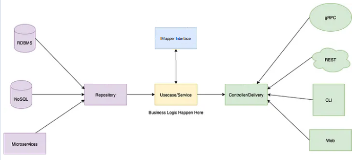
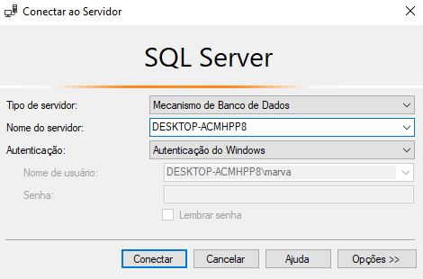
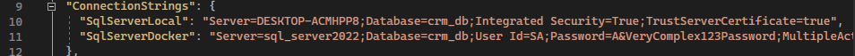
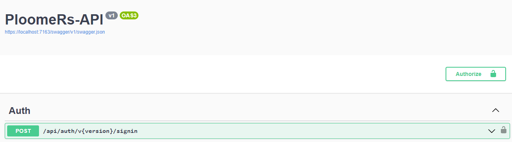
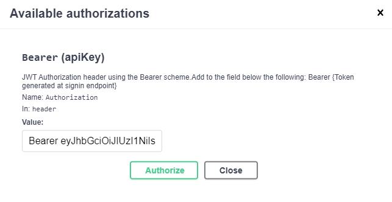

# PloomeRs_Project
## Marcelo Lopes Valerio - LinkedIn https://www.linkedin.com/in/marcelo-lopes-valerio/
## PloomeRs API - processo seletivo Ploomes
### O objetivo deste projeto foi desenvolver uma API simples utilizando .NET Core, Entity Framework e Sql Server, de modo a provar as habilidades com o framework.
## Proposta: uma API de CRM (ou algo bem básico perto disso) com 3 principais aplicativos - Empregados, Clientes e Vendas.
### Minha intenção foi desenvolver 3 aplicativos simples e bem mapeados, e então integrá-los de acordo com as regras de negócio propostas por mim mesmo.
## Design
### Basicamente, para utilizar a API você precisa ser um funcionário, o qual tem um login e senha, e todas as outras aplicações dependem de você estar logado para ter sucesso. Um funcionário pode se registrar, registrar outros funcionários, clientes, e realizar vendas, além de listar todos esses componentes.
### O cliente por sua vez, apenas participa das vendas, e em seu cadastro pode escolher se é uma pessoa física ou jurídica, inserir e validar seu documento, e registrar um ou vários contatos.
### Por último, a venda possuí um funcionário, responsável pela venda, um cliente que realizou a compra, produto, valor, total e data. A seguir, pode-se ver um mapeamento das tabelas.

### A API tem um design arquitetural característico para garantir a aplicação de boas práticas. Basicamente, a request segue uma rota padrão dentro dela. Ela chega pelo controller, que se identifica pela URL e pelo verbo HTTP. O controller então invoca business, que é responsável por aplicar quaisquer regras de negócio, além de, por escolha minha, ser também o responsável pela conversão dos dados no Data Transfer Object, do input para o objeto na API que vai para o banco, e depois de volta para o view que vai para o usuário. Numa API completa, em Business estaria também maiores e mais precisas validações de dados e exceções mais precisas. Por último, Business invoca Repository, que é responsável pela comunicação finalmente com o banco de dados e utiliza o DB context para tal. Esse design tem várias vantagens com relação à manutenção e escalabilidade da API. Esse padrão também é conhecido como Controller, Service and Repository with DTO pattern, porém eu prefiro chamar de Business por também utilizar uma pasta Services para Token authentication e Migrations. Segue uma foto que exemplifica o funcionamento da API.

## Recursos
### Como foi possível ver no mapeamento de objetos, pela tabela funcionário, a API conta com autenticação por JWT, com refresh token, pela biblioteca de suporte do próprio ASP .NET Core.
### Mapeamento de objetos (Data Transfer Objects), utilizando a biblioteca IMapper.
### [FUTURO] Implementação de Docker para facilitar a utilização
## Como iniciar
### Para utilizar a API, além do Visual Studio, será necessário ter uma instância do Sql Server em sua máquina. No arquivo appsettings.json, dentro da pasta Ploomers_project_API, é necessário mudar a connection string "SqlServerLocal". Em server=, é necessário colocar o nome do servidor do Sql Server de sua máquina. Se o seu Sql Server suportar a autenticação com windows, será suficiente. Se não, será necessário especificar um usuário com permissões para criar bancos de dados e uma senha na connection string.

### Agora é so iniciar como qualquer projeto .NET e o servidor deve funcionar. Deve abrir no navegador uma página do Swagger, que ajudou na documentação dos endpoints da API. (Se, por algum motivo der erro nas migrações, abra o terminal no projeto, e digite dotnet ef update database)
## EndPoints
### Os endpoints são divididos em 4 grupos, e para acessar a maioria deles é necessário estar autenticado.
### Os endpoints são: Auth, Clients, Employees, e Sales. Recomenda-se iniciar o teste pelo de funcionários, pois é por ele que é possível se autenticar. Obs: para todos os endpoints, é necessário especificar o 1 na versão da API.
- POST api/v1/employees: posta um noo usuário. Só precisa de primeiro nome, segundo nome e senha, os outros campos são gerados automaticamente.
### Após isso, vá para a aba de Auth, e acesse o seguinte endpoint:
- POST api/auth/v1/signin: email = primeiro_nome.segundo_nome@ploomes.com, senha, como criada no funcionário. Retornará um Access Token e um Refresh Token. Salve ambos.
### Agora, no canto superior direito, haverá um botão de autorize:

### Clique nele, e na aba escreva " Bearer [AccessToken] " (com espaço entre os dois, sem aspas) e clique em Authorize

### Pronto, agora está verificado e pode utilizar toda API. Qualquer aba do Swagger que você acessar, em try out, gerará a requisição autorizada para você, lembre-se de adicionar 1 à versão, e ele também dará um body teste para as requisições que isso for válido, há um CRUD para cada uma das entidades, e algumas regras de negócio e filtros.
### O caminho recomendado é: após o funcionário, crie um cliente, e adicione um contato a ele, e por fim adicione uma venda. Note que, ao listar as vendas do dia (formato YYYY-MM-DD), a venda aparecerá com nome do cliente, do funcionário, valor da venda e etc. porém o interessante é listar novamente funcionários ou clientes, e terá uma lista de todas as vendas da última semana dos mesmos, com inclusive soma do valor total das vendas.
## Todos Endpoints:
### Auth:
- POST api/auth/v1/signin - Logar com o email e senha (Body);
- POST api/auth/v1/refresh - Extender seção longa com access token e refresh token (Body);
- GET api/auth/v1/revoke - Deslogar, e invalidar o token utilizado para a request;
### Employees:
- GET api/v1/employees - Lista todos os funcionários do banco;
- GET api/v1/employees/{ID} - Lista o funcionários de Id espicificado;
- POST api/v1/employees - Cria um novo funcionário (Body);
- PUT api/v1/employees/{ID} - Atuliza os dados do funcionário (Body);
- DELETE api/v1/employees/{ID} - Apaga um usuário do banco;
### Clients:
- GET api/v1/clients - Lista todos os clientes do banco;
- GET api/v1/clients/{ID} - Lista o clientes de Id espicificado;
- POST api/v1/clients - Cria um novo cliente (Body);
- PUT api/v1/clients/{ID} - Atuliza os dados do cliente (Body);
- DELETE api/v1/clients/{ID} - Apaga um cliente do banco;
- POST api/v1/clients/{ID}/contacts - Cria um novo contato atrelado ao cliente na URL (Body);
- DELETE api/v1/clients/{ID}/contacts/{contact ID} - Apaga o contato de ID atrelado ao cliente na URL;
### Sales:
- GET api/v1/sales/client/{Client ID} - Lista as vendas das quais o cliente de Id espicificado participou;
- GET api/v1/sales/employee/{Employee ID} - Lista as vendas das quais o funcionário de Id espicificado participou;
- GET api/v1/sales/{YYYY-MM-DD} - Lista todas as vendas do dia especificado;
- POST api/v1/sales/client/{Client ID} - Cria uma nova venda para o cliente com Id especificado, e o funcionário autenticado (Body);
- PUT api/v1/sales/{Sale ID} - Atuliza os dados da venda (Body);
- DELETE api/v1/sales/{Sale ID} - Apaga uma venda do banco;
## Próximos passos
### Se for possível concluir o projeto, há algumas coisas que eu melhoraria, entre elas vale listar
### - Melhor tratamento de exceções. O tratamento de exceções ainda está muito cru, devido ao tempo e o tamanho do projeto que escolhi, por enquanto apenas retorna Bad Request e o erro interpretado.
### - Suporte ao Docker. Infelizmente não tive tempo o suficiente para aplicar uma conteinerização eficiente para facilitar a inicialização do projeto.
### - Otimização das queries ao banco. Algumas queries realizam multiplas consultar ao banco. O ideal seria reduzir e otimizar algumas delas.